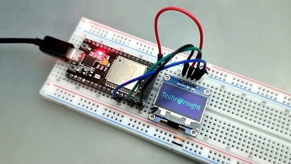

# Projeto: ESP32S e Display OLED 128x64 0.96" SSD1306

 

## Descrição
Neste projeto vamos utilizar um microcontrolador ESP32S e um display OLED SSD1306 de 128x64 0.96" para exibir uma imagem em bitmap, com código criado na Arduino IDE.

## Introdução
Displays OLED são uma opção muito interessante para quem busca visualizar pouca informação mas ainda com muita nitidez. Isso é possível devido ao alto contraste dos displays OLED (Organic Light-Emitting Diode). Cada um dos 128×64 pixels são controlados individualmente via I2C pelo chip controlador SSD1306. O display OLED tem luz própria, logo não há necessidade de backlight, o que intensifica seu contraste e economiza muita energia.

#### Pinagem do Display OLED 0.96″ I2C

|Pino|Descrição|
| :---: | :---: |
|VCC|Conecte este pino à fonte de alimentação do dispositivo (2,2 a 5,5 V).|
|GND|Este pino deve ser conectado ao terra (GND) do microcontrolador ou à fonte de alimentação.|
|SDA (Serial Data)|Este pino é usado para a comunicação de dados serial entre o microcontrolador e o display OLED.|
|SCL (Serial Clock)|Este pino é usado para sincronizar os dados entre o microcontrolador e o display OLED, garantindo uma comunicação precisa e coordenada.|

## Pré-requisitos
* Ter a [IDE](https://www.arduino.cc/en/software/) do Arduino instalada e configurada;
* Instalar a biblioteca Adafruit_SSD1306 e todas as suas dependencias;

## Material Necessário
* Microcontrolador ESP32 ou ESP32s;
* Display OLED SSD1306 128x64 0.96" I2C;
* Protoboard e jumpers;
* Cabo de dados para conexão do microcontrolador ao PC.

## Tabela de Conexões

|Pinos do ESP32S|Pinos do Display SSD1306|
| :---: | :---: |
|3.3 V (1)|VCC (2)|
|GND (38)|GND (1)|
|D22 (36)|SCL (3)|
|D21 (33)|SDA (4)|

## Imagem das Conexões

## Foto do Projeto

